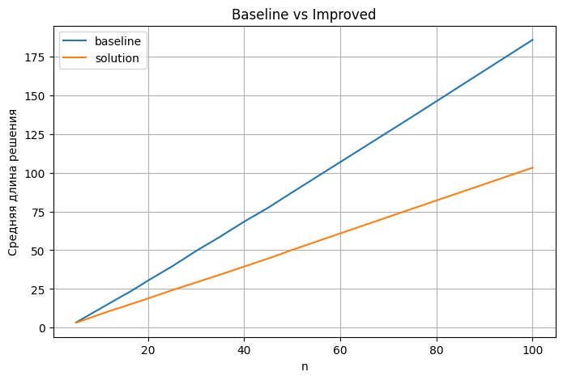
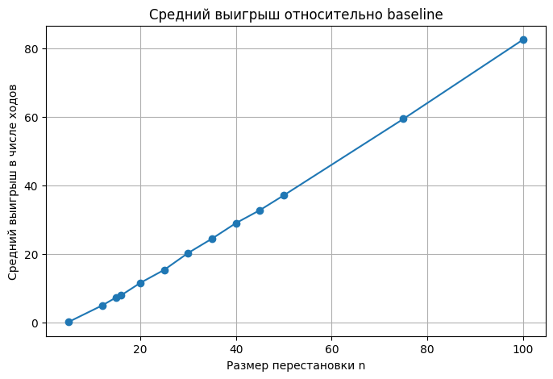

# Pancake Sorting: эвристический поиск и ML-эвристики

Проект посвящён задаче **pancake sorting** — сортировке перестановки с помощью префиксных разворотов (операции вида `R_k`).

Мы исследуем, как улучшить классический алгоритм с помощью:

* эвристического поиска (beam search)
* ручных эвристик (gap, breakpoints)
* обучаемых ML-эвристик

---

# Постановка задачи

Дана перестановка чисел от `0` до `n-1`.
Разрешённая операция — переворот первых `k` элементов:

```
[3, 1, 2, 0] → R3 → [2, 1, 3, 0]
```

Цель:

> найти последовательность таких операций минимальной длины, приводящую к отсортированному виду.

---

# Основные результаты

Метод был протестирован на **2405 перестановках** в рамках соревнования на Kaggle.

* Улучшение baseline: **99.83% случаев (2401 из 2405)**
* Ухудшений: **0**
* Совпадений: **4**

### Качество решений

* baseline: **158 680 шагов**
* итоговое решение: **92 077 шагов**
* суммарный выигрыш: **66 603 шага**
* средний выигрыш: **27.7 шага**
* максимальный выигрыш: **91 шаг**

---

### Интерпретация

* Метод стабильно улучшает решения и не деградирует ни в одном случае
* Выигрыш растёт с увеличением размера задачи
* Алгоритм безопасен: не ухудшает baseline
* Может использоваться как **post-processing** для улучшения любых решений

Особенно сильный эффект наблюдается на больших перестановках

---

### Эффективность

Сравнение с baseline



* Beam search стабильно улучшает baseline
* Увеличение `beam_width` даёт diminishing returns
* Практически оптимальный компромисс:

```
beam_width = 128
depth = 128
```

---

# Подход

## 1. Baseline

Классический жадный алгоритм pancake sorting:

* сложность: `O(n^2)`
* гарантирует корректное решение

---

## 2. Эвристический поиск

Используется **beam search** с оценкой:

```
f(s) = g(s) + w · h(s)
```

где:

* `g(s)` — длина пути
* `h(s)` — эвристика

### Используемые эвристики:

* **gap heuristic**
* **breakpoints**
* **mix (gap + α·breakpoints)**

---

## 3. ML-эвристика

Обучается модель, предсказывающая расстояние до решения:

### Архитектуры

- Embedding MLP
- One-hot MLP
- Residual модели

Используется как:

```
h(s) ≈ distance_to_goal
```

---

### Основные выводы

- Embedding представление значительно лучше one-hot
- Небольшие embedding (dim=32) работают лучше, чем большие
- Residual-блоки критичны для качества
- ML-эвристика позволяет дополнительно улучшать решения

# Масштабируемость



Средний выигрыш растёт с увеличением размера перестановки:

* n ≈ 20 → ~10 шагов
* n ≈ 50 → ~35 шагов
* n = 100 → **~80+ шагов**

Метод особенно эффективен на больших задачах

---

# Пример улучшения

Для одной из перестановок:

```
baseline: 194 шага
solution: 103 шага
выигрыш: 91 шаг
```

почти в **2 раза короче**

---

# Ключевые выводы

* breakpoints немного лучше gap
* beam search даёт стабильный прирост
* увеличение depth почти не влияет
* embedding представление лучше one-hot
* выигрыш растёт с размером задачи

---

# Структура проекта

```
├── data/                  # входные данные
├── notebooks/             # исследования и эксперименты
├── runs/                  # результаты (submission)
├── src/cayleypy_pancake/
│   ├── baseline.py        # базовый алгоритм
│   ├── search.py          # beam search
│   ├── models.py          # ML модели
│   ├── eval.py            # метрики
│   ├── ml/                # ML pipeline
│   └── utils/             # утилиты
```

---

# Установка

```bash
pip install -e .
```

Дополнительно для ML:

```bash
pip install torch numpy pandas scikit-learn
pip install git+https://github.com/cayleypy/cayleypy.git
```

---

# Использование

## Быстрый старт

Самый простой способ попробовать проект:

```bash
python demo.py
```

Также можно запустить интерактивный интерфейс:

```bash
streamlit run app.py
```

## Baseline

```python
from cayleypy_pancake.baseline import pancake_sort_moves

perm = [3,1,2,0]
moves = pancake_sort_moves(perm)
print(moves)
```

---

## Эвристический поиск

```python
from cayleypy_pancake.search import beam_improve_or_baseline_h
```

---

## ML-эвристика

```python
from cayleypy_pancake.ml.pipeline import train_model
```

---

# Ноутбук

Основное исследование:

```
notebooks/pancake_91584_final_edit.ipynb
```

Содержит:

* анализ данных
* эвристики
* beam search
* ML обучение
* финальные результаты

---

# Данные

* `data/test.csv` — тестовые перестановки
* `runs/submission_*.csv` — решения

---

# Итог

Проект показывает, что:

> комбинация эвристического поиска и ML позволяет значительно улучшить решения задачи pancake sorting, особенно на больших размерах.

---

Если проект оказался полезным или интересным — поставьте звезду :)

---

**Проект выполнен в рамках Deep Learning School (DLS)**
